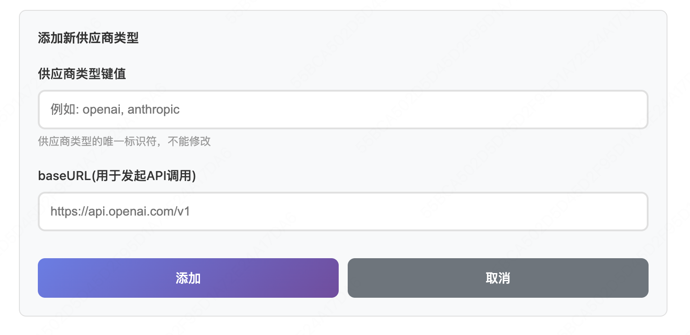
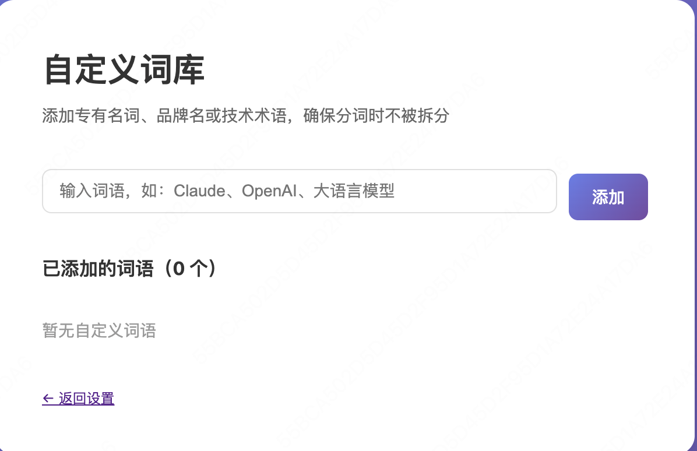
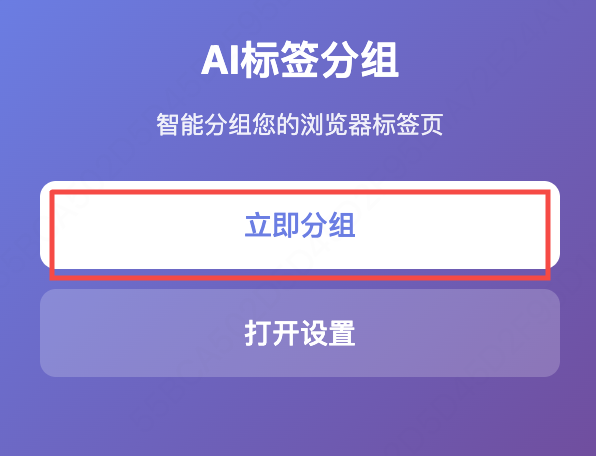

# ai-tab-vue

## 介绍

基于 Vue 3 in Vite开发的 Chrome AI标签分组插件.

利用关键词提取+PageRank排序+LLM大模型来进行网页标签组分类 

## 安装

[Chrome应用商店下载地址](https://chromewebstore.google.com/detail/ai-tab/gkkilbkkklfjacnleenilelejbnamjjh?hl=zh-CN&utm_source=ext_sidebar)

## 配置

安装后进入设置 --> 管理AI供应商类型，添加AI大模型供应商



如果在你的使用场景有专有名词，可以在设置-->自定义词库中配置


最后在设置主界面，添加供应商的Api-key和模型，即可使用

## 使用

非常简单，点击「立刻分组」即可


## 开发
### Recommended IDE Setup

[VS Code](https://code.visualstudio.com/) + [Vue (Official)](https://marketplace.visualstudio.com/items?itemName=Vue.volar) (and disable Vetur).

### Recommended Browser Setup

- Chromium-based browsers (Chrome, Edge, Brave, etc.):
  - [Vue.js devtools](https://chromewebstore.google.com/detail/vuejs-devtools/nhdogjmejiglipccpnnnanhbledajbpd) 
  - [Turn on Custom Object Formatter in Chrome DevTools](http://bit.ly/object-formatters)
- Firefox:
  - [Vue.js devtools](https://addons.mozilla.org/en-US/firefox/addon/vue-js-devtools/)
  - [Turn on Custom Object Formatter in Firefox DevTools](https://fxdx.dev/firefox-devtools-custom-object-formatters/)

### Type Support for `.vue` Imports in TS

TypeScript cannot handle type information for `.vue` imports by default, so we replace the `tsc` CLI with `vue-tsc` for type checking. In editors, we need [Volar](https://marketplace.visualstudio.com/items?itemName=Vue.volar) to make the TypeScript language service aware of `.vue` types.

### Customize configuration

See [Vite Configuration Reference](https://vite.dev/config/).

### Project Setup

```sh
npm install
```

#### Compile and Hot-Reload for Development

```sh
npm run dev
```

#### Type-Check, Compile and Minify for Production

```sh
npm run build
```

#### Lint with [ESLint](https://eslint.org/)

```sh
npm run lint
```
